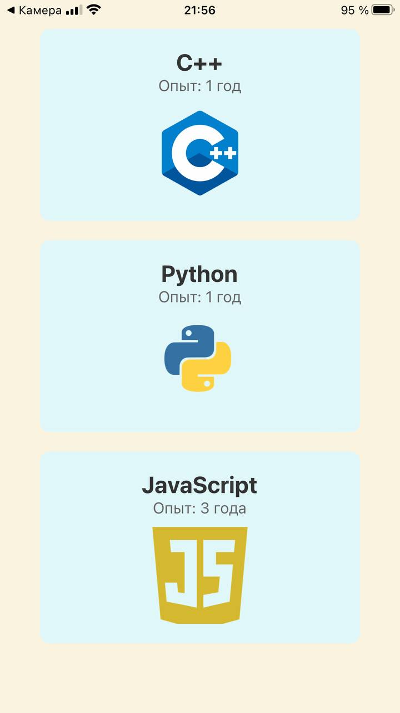

# Languages List App

## Описание

Languages List App — это учебный проект, который представляет собой мобильное приложение, созданное с использованием React Native и Expo и отображающее список языков программирования. Каждая карточка языка включает название, уровень опыта и логотип.

## Функции

- Просмотр списка языков программирования
- "Pull to Refresh" для обновления списка

## Скриншот



## Установка и запуск

1. Склонируйте репозиторий:

   ```bash
   git clone https://github.com/AnastasiiaXX/mobile-flatLists-practice.git

2. Перейдите в директорию проекта:

   ```bash
   cd languages-list-app

3. Установите зависимости:
   ```bash
   npm install

4. Запустите приложение:
   ```bash
   npx expo start

5. Отсканируйте QR-код с помощью приложения Expo Go на вашем мобильном устройстве, чтобы открыть приложение.

## Технологии

- **React Native**
- **Expo**
- **JavaScript**
